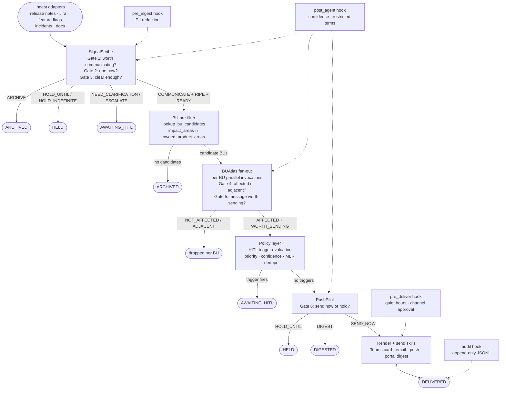

# PulseCraft

> **AI-agent-driven change communication intelligence — turns marketplace changes into BU-ready notifications with safety gates, audit trails, and human review.**

[](https://www.python.org/)
[](#testing)
[](https://docs.anthropic.com/en/docs/about-claude/models/overview)
[](#license)
[](#roadmap)

---

## What This Is

Marketplace product changes arrive as vendor release notes, Jira tickets, feature flags, and incident reports. Someone on your team reads them, decides which Business Unit heads need to know, writes a summary, and sends it — or doesn't, because the queue is long and judgment calls are hard.

PulseCraft automates that loop without removing human accountability. Three specialist AI agents collaborate at six judgment gates to turn raw change artifacts into structured, BU-tailored notifications. Each gate is a genuine decision: *is this worth communicating at all? is now the right time? is this specific BU actually affected?* When a gate is uncertain, the system routes to a human reviewer instead of guessing. Every decision is audited, every routing choice is logged, and the whole run can be replayed.

The core design principle is the **agent-vs-code split**: agents express preferences ("I think this is worth sending now"); deterministic policy code enforces invariants ("quiet hours say no"). When agent preference conflicts with policy, policy wins — and both decisions are logged for calibration. This keeps the system's safety properties auditable without depending on any single LLM's judgment for anything that must be guaranteed.

**Current state:** Walking skeleton complete. All three agents live with real LLM calls (Claude Sonnet 4.6). Eight representative fixtures exercise all gates end-to-end. Eval harness passing (10 stable, 1 acceptable variance, 0 false positives). Synthetic data only; no production deployment.

---

## Installation

```bash
# 1. Clone the repo
git clone <repo-url> pulsecraft-change-intelligence
cd pulsecraft-change-intelligence

# 2. Create virtual environment (Python 3.14)
uv venv && uv pip install -e ".[dev]"

# 3. Set your Anthropic API key
echo "ANTHROPIC_API_KEY=sk-ant-..." > .env

# 4. Verify the install
.venv/bin/pytest tests/ -m "not llm and not eval" -q
# 619 passed
```

---

## Quick Start

**Mode 1 — Run a fixture through the full pipeline (real agents):**

```bash
.venv/bin/pulsecraft dryrun fixtures/changes/change_001_clearcut_communicate.json \
  --real-signalscribe --real-buatlas --real-pushpilot
```

**Mode 2 — Explain the decision trail for a processed change:**

```bash
.venv/bin/pulsecraft explain a1b2c3d4
# Resolves 8-char prefix to full change_id and prints the human-readable trail
```

**Mode 3 — Approve a HITL-pending item:**

```bash
.venv/bin/pulsecraft pending                        # list pending items
.venv/bin/pulsecraft approve a1b2c3d4 --reviewer "your-name"
```

**Mode 4 — Run the eval harness (opt-in, makes real LLM calls):**

```bash
PULSECRAFT_RUN_EVAL_TESTS=1 .venv/bin/python scripts/eval/run_all.py --runs 3
# Baseline: stable=10 / acceptable=1 / unstable=1 / PASS  ($1.74, ~27 min)
```

---

## Who This Is For

| Persona | Pain point | What PulseCraft gives them |
|---|---|---|
| **Head of AI (Sponsor)** | Needs a scalable, auditable way to close the "change-to-awareness" gap without building a dedicated comms team | Walking skeleton to demo; eval baseline showing 0 false positives |
| **BU Communication Lead** | Reads 30+ vendor release notes a week; most don't apply to their BU | Pre-filtered, BU-tailored summaries with explicit reasoning for why each was chosen |
| **Operations / HITL Reviewer** | Must approve outgoing notifications but has limited context | Full decision trail via `/explain`; HITL queue with structured reasons; one-command approve/reject |
| **InfoSec / Compliance** | Needs to know: what data passes through, what are the guardrails, what is logged | Deterministic hooks (PII redaction, MLR term detection, restricted-term scan); append-only audit JSONL; agent-vs-code policy split |
| **Pilot BU Head** | Receives notifications; doesn't want to be spammed with changes that don't affect them | BUAtlas gate explicitly distinguishes AFFECTED vs ADJACENT; default bias is to hold rather than send |
| **AI / Platform Engineer** | Wants to understand the architecture and extend it | Protocol-based agent interfaces; modular skill library; prompt-driven build trail in `prompts/` |

---

## Example Output

Running `/explain` on the clearcut-communicate fixture (fixture 001) after a full pipeline run:

```
$ .venv/bin/pulsecraft explain a1b2c3d4
━━━━━━━━━━━━━━━━━━━━━━━━━━━━━━━━━━━━━━━━━━━━━━━━━━━━━━━━━━━━━━
 PulseCraft Decision Trail — a1b2c3d4 (run: 2026-04-23T11:44Z)
━━━━━━━━━━━━━━━━━━━━━━━━━━━━━━━━━━━━━━━━━━━━━━━━━━━━━━━━━━━━━━

 Change: Prior Authorization Submission Form — Redesigned Validation UI
 Journey: RECEIVED → INTERPRETED → ROUTED → PERSONALIZED → AWAITING_HITL

 [SignalScribe]
   Gate 1  COMMUNICATE   0.92   "Visible, customer-facing UI behavior change
                                 affecting all HCP portal users in the specialty
                                 pharmacy ordering workflow."
   Gate 2  RIPE          0.88   "Rollout imminent; decision window open for BU
                                 preparation."
   Gate 3  READY         0.85   "Sufficient context. Change scope and impact
                                 clearly stated."

 [BUAtlas — bu_alpha]
   Gate 4  AFFECTED      0.91   "bu_alpha owns specialty_pharmacy, hcp_portal_ordering,
                                 and prior_auth_workflow — all three primary impact
                                 areas of this change."
   Gate 5  WORTH_SENDING 0.87   Message quality: high. Action is clear.

 [Orchestrator — policy layer]
   HITL trigger: priority_p0  (P0 change always routes to human review)
   → State: AWAITING_HITL

 Cost: 2 LLM invocations · $0.13 · 86s
━━━━━━━━━━━━━━━━━━━━━━━━━━━━━━━━━━━━━━━━━━━━━━━━━━━━━━━━━━━━━━
```

For a pure internal refactor (fixture 002), the same command shows a one-line trail:

```
 [SignalScribe]
   Gate 1  ARCHIVE       0.94   "Internal code refactoring. No external-facing
                                 behavior change. No user impact."
 Journey: RECEIVED → ARCHIVED
 Cost: 1 LLM invocation · $0.04 · 19s
```

---

## Architecture

### Mermaid diagram



### ASCII fallback

```
[Ingest adapters]
      │
      ▼
[SignalScribe: gates 1-3]────────ARCHIVE──────────────► ARCHIVED
      │                   └───── HOLD ─────────────────► HELD
      │                   └───── ESCALATE ──────────────► AWAITING_HITL
      │ COMMUNICATE+RIPE+READY
      ▼
[BU pre-filter]──────────────── no match ──────────────► ARCHIVED
      │ candidate BUs
      ▼
[BUAtlas fan-out: gates 4-5] ── NOT_AFFECTED/ADJACENT ─► (dropped)
      │ AFFECTED+WORTH_SENDING
      ▼
[Policy: HITL triggers] ──────── trigger fires ─────────► AWAITING_HITL
      │ no triggers
      ▼
[PushPilot: gate 6] ─────────── HOLD_UNTIL ────────────► HELD
      │              └────────── DIGEST ─────────────────► DIGESTED
      │ SEND_NOW
      ▼
[Render + send skills]
      │
      ▼
   DELIVERED

Hooks fire at every stage:
  pre_ingest ──── PII redaction before SignalScribe
  post_agent ──── confidence + restricted-term check after each agent
  pre_deliver ─── quiet hours + channel approval before send
  audit ────────── append-only JSONL at every transition
```

---

## Pipeline Stages

| Stage | Owner | What it decides | Failure mode |
|---|---|---|---|
| **Ingest** | Skill library (`skills/ingest/`) | Fetch + normalize source artifact → `ChangeArtifact` | `IngestNotFound`, `IngestMalformed` |
| **Interpret** | SignalScribe (gates 1–3) | Worth communicating? Ripe? Clear enough? | ARCHIVE / HELD / AWAITING_HITL |
| **Route** | Orchestrator + `lookup_bu_candidates` | Which BUs are in scope for this change? | ARCHIVED if no candidates |
| **Personalize** | BUAtlas (gates 4–5), parallel per BU | Is this BU affected? Is the drafted message worth sending? | Per-BU drop (ADJACENT/NOT_AFFECTED) |
| **Gate (HITL check)** | Orchestrator policy layer | Does any trigger require human review? | AWAITING_HITL |
| **Time** | PushPilot (gate 6) | Is now the right time to send? | HELD / DIGESTED |
| **Render** | Skill library (`skills/delivery/`) | Format notification for target channel | `DeliveryFailed`, `DeliveryRetriable` |
| **Send** | Skill library (`skills/delivery/`) | Deliver to recipient system | `DeliveryUnauthorized` |
| **Audit** | Orchestrator + audit hook | Record every decision and transition | Fail-open; never blocks pipeline |

---

## The Six Gates

| # | Gate | Owner | Decision verbs | Failure to act |
|---|---|---|---|---|
| 1 | Worth communicating at all? | SignalScribe | `COMMUNICATE` · `ARCHIVE` · `ESCALATE` | Over-notification erodes BU attention |
| 2 | Is the timing right now? | SignalScribe | `RIPE` · `HOLD_UNTIL(date)` · `HOLD_INDEFINITE` | Communicating too early creates noise |
| 3 | Clear enough to hand off? | SignalScribe | `READY` · `NEED_CLARIFICATION(questions)` · `UNRESOLVABLE` | Ambiguity in the message harms credibility |
| 4 | Is this BU actually affected? | BUAtlas (per BU) | `AFFECTED` · `ADJACENT` · `NOT_AFFECTED` | False positives in BU targeting erode trust faster than false negatives |
| 5 | Is the drafted message worth their attention? | BUAtlas (per BU) | `WORTH_SENDING` · `WEAK` · `NOT_WORTH` | A weak message is worse than no message |
| 6 | Right time to send? | PushPilot | `SEND_NOW` · `HOLD_UNTIL(time)` · `DIGEST` · `ESCALATE` | Sending at 11 PM creates friction |

Each gate also emits a **confidence score** (0.0–1.0). Scores below per-gate thresholds (defined in `config/policy.yaml`) route to human review automatically.

---

## How the System Thinks

The core data structure is the `ChangeBrief` — SignalScribe's structured output, handed to BUAtlas and onward:

```json
{
  "brief_id": "f7e3c921-4b58-4d2a-9e06-1c8a5b2f0d73",
  "change_id": "a1b2c3d4-e5f6-4a7b-8c9d-0e1f2a3b4c5d",
  "produced_by": { "agent": "signalscribe", "version": "1.0" },
  "change_type": "behavior_change",
  "title": "Prior Authorization Submission Form — Redesigned Validation UI",
  "summary": "The HCP portal prior authorization form has been redesigned with inline validation...",
  "impact_areas": ["specialty_pharmacy", "hcp_portal_ordering", "prior_auth_workflow"],
  "affected_personas": ["hcp_portal_users", "specialty_pharmacy_staff"],
  "decisions": [
    {
      "gate": 1,
      "verb": "COMMUNICATE",
      "reason": "Visible, customer-facing UI behavior change affecting all HCP portal users...",
      "confidence": 0.92,
      "agent": { "name": "signalscribe" }
    },
    {
      "gate": 2,
      "verb": "RIPE",
      "reason": "Rollout imminent; decision window open for BU preparation.",
      "confidence": 0.88,
      "agent": { "name": "signalscribe" }
    },
    {
      "gate": 3,
      "verb": "READY",
      "reason": "Sufficient context. Change scope and impact clearly stated.",
      "confidence": 0.85,
      "agent": { "name": "signalscribe" }
    }
  ],
  "timeline": { "status": "ripe", "start_date": "2026-04-28" },
  "sources": [{ "type": "release_note", "ref": "rn-hcp-portal-2026-04" }]
}
```

BUAtlas receives this brief and outputs a `PersonalizedBrief` — one per candidate BU:

```json
{
  "bu_id": "bu_alpha",
  "relevance": "affected",
  "priority": "P0",
  "message_quality": "worth_sending",
  "confidence_score": 0.91,
  "headline": "HCP Portal prior auth form redesigned — validation now inline",
  "body": "The prior authorization submission form has been updated with inline field validation...",
  "recommended_actions": [
    { "description": "Brief specialty pharmacy staff on new form layout", "owner": "<head-alpha>" }
  ],
  "decisions": [
    { "gate": 4, "verb": "AFFECTED", "reason": "bu_alpha owns all three primary impact areas...", "confidence": 0.91 },
    { "gate": 5, "verb": "WORTH_SENDING", "reason": "Message is actionable and concise.", "confidence": 0.87 }
  ]
}
```

Every field has a source: the agent's reasoning, the confidence score, and the citation back to the original artifact. Nothing is inferred silently.

---

## Decision Guides

### Gate 1 — Is this worth communicating?

```
Start: new change artifact
         │
         ▼
Is there visible behavior change for any user, HCP, patient, partner, or system?
         │
    Yes ─┤──── No ──► Does it touch regulatory/compliance surfaces?
         │                    │
         ▼               Yes ─┤──── No ──► ARCHIVE
      COMMUNICATE             │
                         COMMUNICATE (with escalation flag)
         │
Does the artifact have enough specifics to act on?
         │
    Yes ─┤──── No ──► Is it vague enough to be unresolvable?
         │                    │
    COMMUNICATE          Yes ─┤──── No ──► ESCALATE (human judgment)
                              │
                           ARCHIVE
```

### Gate 4 — Is this BU affected vs. adjacent?

```
Start: ChangeBrief + BU profile
         │
         ▼
Do the brief's impact_areas intersect with this BU's owned_product_areas?
         │
    Yes ─┤──── No ──► NOT_AFFECTED (drop)
         │
Is the intersection direct ownership, or tangential?
         │
  Direct ┤──── Tangential ──► ADJACENT (excluded from delivery)
         │
       AFFECTED
         │
Is the drafted message clear, accurate, and actionable for this BU?
         │
    Yes ─┤──── Weak ──► WEAK (second WEAK → HITL)
         │       └────── Not useful ──► NOT_WORTH
  WORTH_SENDING
```

### Gate 6 — Send now or hold?

```
Start: PersonalizedBrief + BU channel policy
         │
         ▼
Is this a P0 change?
         │
    Yes ─┤──── No ──► Is now within quiet hours for this BU?
         │                    │
    SEND_NOW            Quiet ┤──── Not quiet ──► Is priority P1?
   (post-HITL)                │                           │
                        HOLD_UNTIL(next window)     Yes ─┤──── No ──► Digest preference?
                                                          │                   │
                                                      SEND_NOW          Yes → DIGEST
                                                                         No → SEND_NOW

Note: agent expresses this preference; deterministic policy code in the
orchestrator enforces quiet hours and channel approval as hard constraints.
```

### HITL trigger evaluation — which trigger fires first?

```
Evaluated in priority order:
  1. priority_p0?                         ──► HITL (always)
  2. second_weak_from_gate_5?             ──► HITL
  3. confidence_below_threshold?          ──► HITL
  4. any_agent_escalate?                  ──► HITL
  5. restricted_term_detected?            ──► HITL (hard block)
  6. mlr_sensitive_content_detected?      ──► HITL (MLR review)
  7. draft_contains_commitment_or_date?   ──► HITL
  8. dedupe_or_rate_limit_conflict?       ──► HITL (judgment call)

First match wins. Multiple triggers are all logged.
No trigger? → proceed to PushPilot.
```

---

## Configuration

### Confidence thresholds (`config/policy.yaml`)

```yaml
confidence_thresholds:
  signalscribe:
    gate_1_communicate: 0.75   # below → ESCALATE
    gate_1_archive: 0.60       # below → ESCALATE
    gate_2_ripe: 0.70
    gate_3_ready: 0.75
  buatlas:
    gate_4_affected: 0.60      # below → downgrade to ADJACENT
    gate_5_worth_sending: 0.60
  pushpilot:
    gate_6_any: 0.60
```

### Channel routing (`config/channel_policy.yaml`)

```yaml
approved_channels:
  global: [teams, email]        # approved for all BUs
  restricted:
    push: [bu_beta]             # opt-in; not enabled in v1 for most BUs
    portal_digest: []           # deferred to v0.2

channel_selection_rules:
  - when: { priority: P0 }
    channel: teams
    also_send_to: [email]       # P0 is dual-channel
  - when: { priority: P1 }
    channel: teams
  - when: { priority: P2 }
    channel: email

quiet_hours_default:
  timezone: "America/Chicago"
  start: "19:00"
  end: "07:00"
```

### Preset operating modes

| Mode | What changes | When to use |
|---|---|---|
| **`strict`** (pilot default) | Higher confidence thresholds (+0.10), all HITL triggers active, quiet hours enforced | Live pilot with real BUs; anything uncertain goes to human review |
| **`permissive`** (dev/exploratory) | Lower thresholds, HITL only for P0 + MLR, no quiet hours | Exploring new fixture coverage; understanding where the boundaries are |
| **`demo`** (sponsor presentations) | Mock agents (no LLM calls), pre-scripted decisions, instant responses | Demo days; showcase the pipeline flow without API cost |

To run in demo mode:

```bash
.venv/bin/pulsecraft run-change fixtures/changes/change_001_clearcut_communicate.json
# Uses mock agents by default — no API key needed, <1s response
```

---

## Guardrail Hooks

Four hooks enforce safety invariants at runtime. All run deterministically (no LLM calls).

| Hook | Stage | Fail mode | What it checks |
|---|---|---|---|
| `pre_ingest` | Before SignalScribe | **closed** (pipeline fails) | PII / credential redaction in `raw_text`; rejects if not a string |
| `post_agent` | After each agent | **closed** | Confidence threshold enforcement (positive verbs only); restricted-term scan in message text |
| `pre_deliver` | Before each delivery | **closed** | Quiet hours; approved channel check |
| `audit` | Every transition | **open** (never blocks) | Writes `HOOK_FIRED` record to audit JSONL |

**Fail-closed** means a hook failure transitions the pipeline to FAILED (not silently dropped).

**The routing-verb exception:** when any agent decision in a set is a routing verb (`ESCALATE`, `ARCHIVE`, `HOLD_INDEFINITE`, etc.), the `post_agent` hook skips confidence checks for all decisions in the set. Reason: if the agent self-routed to a hold/review state, the positive-path confidence is irrelevant — the routing decision is itself the safeguard.

---

## CI/CD Integration

No CI workflow is configured yet (coming in v0.2). When added, the natural integration points are:

```yaml
# .github/workflows/ci.yml (planned)
jobs:
  test:
    steps:
      - run: uv pip install -e ".[dev]"
      - run: .venv/bin/pytest tests/ -m "not llm and not eval" -q
        # 619 deterministic tests; zero LLM calls; ~4s

  eval:
    if: github.ref == 'refs/heads/main'
    steps:
      - run: PULSECRAFT_RUN_EVAL_TESTS=1 .venv/bin/python scripts/eval/run_all.py --runs 3
        # Optional; opt-in; ~$1.74 and ~27 min per run
        env:
          ANTHROPIC_API_KEY: ${{ secrets.ANTHROPIC_API_KEY }}
```

The test suite is structured so the vast majority of tests are fast and free:

| Suite | Marker | LLM calls | Cost | Speed |
|---|---|---|---|---|
| Unit + integration | *(default)* | None | $0 | ~4s (619 tests) |
| Eval harness | `eval` | Yes (opt-in via env var) | ~$1.74 | ~27 min |
| LLM integration | `llm` | Yes (opt-in) | Varies | Minutes |

---

## Use Cases

PulseCraft is domain-agnostic, but was designed with the following scenarios in mind:

| Scenario | Change type | Key gate | Expected routing |
|---|---|---|---|
| **Formulary change affects specialty pharmacy BU** | Behavior change to ordering portal | Gate 4 (AFFECTED vs ADJACENT) | AFFECTED → WORTH_SENDING → HITL (P0) |
| **MLR-sensitive HCP educational module update** | Doc update with clinical language | Gate 3 + MLR hook | READY → HITL (mlr_sensitive trigger) |
| **Feature flag ramping to 5% of internal users** | Early-stage flag rollout | Gate 2 | COMMUNICATE + HOLD_UNTIL (not yet ripe) |
| **Pure internal dependency version bump** | Infrastructure change | Gate 1 | ARCHIVE (no external impact) |
| **Analytics portal gets new export capability** | New feature, analytics BU only | Gates 1–5 | AFFECTED (bu_alpha or matching BU) → delivery |
| **Post-hoc: change shipped with no prior notice** | Already-shipped feature | Gate 2 (ALREADY_SHIPPED status) | COMMUNICATE + RIPE → proceed |
| **Multi-BU change with parallel personalization** | Cross-BU platform change | BUAtlas fan-out | Each BU evaluated independently; ADJACENT BUs dropped |
| **Ambiguous artifact: "various improvements"** | Vague release note | Gate 1 | ARCHIVE (maximally vague → unactionable) or ESCALATE |

---

## Repository Structure

```
pulsecraft-change-intelligence/
│
├── src/pulsecraft/               # Main Python package
│   ├── agents/                   #   SignalScribe, BUAtlas, PushPilot (real LLM-backed)
│   │   ├── signalscribe.py       #   Gates 1-3; loads prompt from .claude/agents/
│   │   ├── buatlas.py            #   Gates 4-5; per-BU invocation
│   │   ├── buatlas_fanout.py     #   asyncio fan-out + FanoutFailure isolation
│   │   └── pushpilot.py          #   Gate 6; delivery timing
│   ├── orchestrator/             #   Deterministic pipeline spine
│   │   ├── engine.py             #   run_change(); policy enforcement; HITL routing
│   │   ├── states.py             #   WorkflowState StrEnum; state machine transitions
│   │   ├── audit.py              #   Append-only JSONL audit writer
│   │   ├── hitl.py               #   HITL queue; HITLReason StrEnum
│   │   ├── agent_protocol.py     #   Protocol interfaces (no concrete agent imports)
│   │   └── mock_agents.py        #   Scripted mock agents for fast/free testing
│   ├── skills/                   #   Reusable skill library
│   │   ├── ingest/               #   5 ingest adapters (release notes, Jira, feature flags, incidents, docs)
│   │   ├── delivery/             #   4 renderers + 3 send adapters + scheduler
│   │   ├── registry.py           #   lookup_bu_candidates
│   │   ├── policy.py             #   check_confidence_threshold, check_restricted_terms
│   │   ├── dedupe.py             #   compute_dedupe_key, has_recent_duplicate
│   │   ├── audit_skill.py        #   write_audit (thin wrapper)
│   │   ├── past_engagement.py    #   lookup_past_engagement
│   │   └── explain_chain.py      #   build_explanation; run-boundary detection
│   ├── cli/                      #   Typer CLI; 13 subcommands
│   │   └── commands/             #   run_change, dryrun, approve, reject, edit, answer,
│   │                             #   replay, pending, digest, audit, metrics, explain, ingest
│   ├── hooks/                    #   Guardrail hooks (deterministic; no LLM)
│   │   ├── pre_ingest.py         #   PII redaction
│   │   ├── post_agent.py         #   Confidence + restricted-term check
│   │   ├── pre_deliver.py        #   Quiet hours + channel approval
│   │   └── audit_hook.py         #   Append HOOK_FIRED record
│   ├── schemas/                  #   Pydantic models for all data contracts
│   ├── config/                   #   Typed YAML loaders
│   └── eval/                     #   Eval harness (classifier, runner, reporter, aggregator)
│
├── .claude/                      # Claude Code configuration
│   ├── agents/                   #   System prompts: signalscribe.md, buatlas.md, pushpilot.md
│   └── settings.json             #   Hook registrations
│
├── schemas/                      # JSON Schema files (source of truth for data contracts)
├── config/                       # Runtime config: bu_registry.yaml, bu_profiles.yaml,
│                                 #   policy.yaml, channel_policy.yaml
├── templates/                    # Jinja2 message templates (Teams card, email, push, digest)
├── fixtures/                     # Synthetic change artifacts (8 coverage fixtures)
│   ├── changes/                  #   change_001_clearcut_communicate.json … change_008
│   └── sources/                  #   Per-adapter source fixtures (release notes, Jira, etc.)
├── tests/                        # Test suite (619 tests, default; no LLM calls)
│   ├── unit/                     #   Per-module unit tests
│   ├── integration/              #   End-to-end integration tests (mock agents)
│   └── eval/                     #   Eval harness tests (opt-in, LLM calls)
├── scripts/eval/                 # Eval entry points: run_signalscribe.py, run_all.py, …
├── audit/                        # Runtime audit output (gitignored except eval/ baseline)
│   └── eval/2026-04-23-baseline/ #   Committed baseline: stable=10/acceptable=1/PASS
├── design/                       # Planning docs, ADRs, decision criteria
│   ├── planning/                 #   00-planning-index.md, 01-decision-criteria.md
│   ├── adr/                      #   ADR-001, ADR-002
│   └── dryrun/                   #   2026-04-23-dryrun-report.md
├── prompts/                      # Prompt-driven build trail (00–14.5)
├── pyproject.toml                # Package config; pytest markers; ruff + mypy settings
└── CLAUDE.md                     # Developer log: standing instructions for all Claude Code sessions
```

---

## Testing

```bash
# Fast suite — unit + integration tests, zero LLM calls (~4s)
.venv/bin/pytest tests/ -m "not llm and not eval" -q
# 619 passed

# Type checking
.venv/bin/mypy src/pulsecraft/ --ignore-missing-imports

# Linting
.venv/bin/ruff check src/ tests/

# Eval harness — opt-in, makes real LLM calls (~$1.74, ~27 min for full suite)
PULSECRAFT_RUN_EVAL_TESTS=1 .venv/bin/python scripts/eval/run_all.py

# Single agent eval
PULSECRAFT_RUN_EVAL_TESTS=1 .venv/bin/python scripts/eval/run_signalscribe.py --runs 3
```

The test pyramid:

| Layer | Count | What it covers |
|---|---|---|
| Unit | ~550 | Individual modules, schema parity, classifiers, hooks, skills |
| Integration | ~69 | Full mock-agent pipeline runs, CLI smoke tests, explain output |
| Eval | 15 (opt-in) | Real LLM behavior, variance classification, false-positive detection |

---

## Comparison with Alternatives

| Approach | Accuracy | Latency | Cost | Auditability | BU personalization | Regulated content safety |
|---|---|---|---|---|---|---|
| **PulseCraft** | Calibrated (eval baseline: 0 false positives) | 15–90s/change | ~$0.13–0.25/change | Full audit JSONL, replayable | Native (per-BU gate 4-5) | Hooks + HITL routing |
| **PM-written Slack summaries** | High (human judgment) | Hours to days | High (human time) | None | Done by hand, ad hoc | Depends on individual |
| **Blanket email blasts** | Low (no filtering) | Fast | Cheap | None | None | None |
| **Homegrown rule engines** | Brittle (breaks on phrasing changes) | Fast | Cheap | Possible | Rarely | Hard to maintain |
| **Generic LLM chat assistant** | Variable (no calibration, no eval) | Seconds | Low | None | None | No guardrails |

**Where PulseCraft is better:** BU-specific targeting, confidence calibration with human escalation, MLR/restricted-term guardrails, full audit trail.

**Where alternatives are better:** PM judgment handles political nuance PulseCraft cannot; blanket blasts are zero-setup; rule engines are cheaper at scale if the domain is stable.

---

## Roadmap

### ✅ v0.1.0 — Walking skeleton (current)

- Three LLM-backed agents (SignalScribe, BUAtlas, PushPilot) at six gates
- Deterministic orchestrator with state machine, HITL queue, audit writer
- Guardrail hooks (PII redaction, confidence, restricted terms, quiet hours)
- Delivery rendering (Teams cards, email, push, portal digest via Jinja2)
- 13 CLI subcommands including `/explain` decision trail
- Ingest adapters (release notes, Jira/ADO, docs, feature flags, incidents)
- Eval harness with variance-aware classification; baseline PASS (0 false positives)
- 619 tests; synthetic data only

### 🟡 v0.2.0 — Pilot-ready (next)

- Real ingest transports (Jira API, ServiceNow, Confluence)
- Real delivery transports (Microsoft Teams webhook, Exchange/SMTP)
- Semantic BU pre-filter (embedding-based similarity, not just keyword intersection)
- Production LLM runtime (Bedrock or Azure AI Foundry; InfoSec approval required)
- Two-BU pilot with real change artifacts and real BU heads
- Confidence threshold tuning from pilot feedback
- CI/CD pipeline with deterministic test gate + opt-in eval gate

### ⚪ v0.3.0+ — Scale

- MLR co-reviewer agent: parallel review for scientific communication content
- Feedback loop: BU-head read/action rates feed back to gate-5 calibration
- Multi-channel orchestration: Teams + email + portal in coordinated sequence
- Semantic change deduplication: detect same underlying change from multiple sources
- Natural-language operator commands ("hold everything for bu_alpha this week")

---

## Contributing

This is an internal AbbVie project in active development. The build is prompt-driven: each increment is specified in a prompt file in `prompts/`, run in Claude Code, and committed as a single feature commit.

To understand the codebase before contributing:

1. Read [`CLAUDE.md`](CLAUDE.md) — standing instructions for all Claude Code sessions; explains the build model, conventions, and what not to do
2. Read [`design/planning/01-decision-criteria.md`](design/planning/01-decision-criteria.md) — the six-gate framework; source of truth for any agent behavior question
3. Read [`design/planning/00-planning-index.md`](design/planning/00-planning-index.md) — current phase, completed artifacts, open decisions
4. Run the test suite: `.venv/bin/pytest tests/ -m "not llm and not eval" -q`

Convention reminders:

- No real AbbVie identifiers anywhere (BU names, product names, people, internal URLs). Use `bu_alpha`–`bu_zeta` and `<descriptor>` placeholders.
- One prompt = one feature commit. Do not batch unrelated work.
- Schemas are invariant across agent iterations. Schema changes require explicit discussion.
- Don't silently weaken tests to make them pass.

---

## References

- [Claude Sonnet 4.6 — Anthropic model docs](https://docs.anthropic.com/en/docs/about-claude/models/overview)
- [Anthropic Python SDK](https://github.com/anthropics/anthropic-sdk-python)
- [Pydantic v2](https://docs.pydantic.dev/latest/)
- [Typer — CLI framework](https://typer.tiangolo.com/)
- [Jinja2 — template engine](https://jinja.palletsprojects.com/)
- [Tenacity — retry library](https://tenacity.readthedocs.io/)
- [structlog — structured logging](https://www.structlog.org/)
- [uv — Python package manager](https://docs.astral.sh/uv/)

---

## License

**Internal AbbVie project. All rights reserved.**

This repository contains proprietary AbbVie internal tooling. It is not licensed for external use, redistribution, or modification without written permission from AbbVie.

> For Claude Code sessions working in this repo: read [`CLAUDE.md`](CLAUDE.md) before taking any action. It contains standing instructions, build conventions, and the complete build state.
