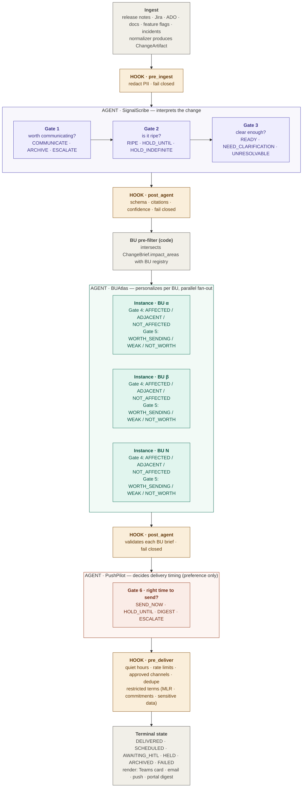

# PulseCraft

> AI agents that turn marketplace changes into BU-ready notifications — with safety gates, audit trails, and human-in-the-loop review.

[](https://www.python.org/)
[](#testing)
[](https://docs.anthropic.com/en/docs/about-claude/models/overview)
[](#license)
[](#roadmap)

---

## Overview

BU heads at scale miss important changes or drown in irrelevant ones. Vendor release notes arrive daily; most don't apply to any given BU, and the ones that do require judgment to interpret. Hand-written Slack summaries from PMs don't scale; rule engines break on phrasing changes and can't reason about business relevance; blanket email blasts condition recipients to ignore them.

PulseCraft solves this with three specialist LLM agents collaborating at six judgment gates, wrapped in a deterministic orchestrator and four guardrail hooks. The system's default answer is always "don't send" — it takes affirmative signals at every gate to produce a notification. SignalScribe interprets the change artifact and decides whether it's worth communicating, whether the timing is right, and whether the interpretation is clear enough to act on. BUAtlas runs in parallel per candidate BU, deciding whether each BU is genuinely affected and whether the drafted message is worth that BU head's attention. PushPilot decides whether now is the right time to deliver.

What makes PulseCraft different from a generic LLM pipeline is the agent-vs-code split: agents express preference, code enforces invariants. PushPilot can say `SEND_NOW` and the `pre_deliver` hook will still enforce quiet hours, rate limits, and MLR-term restrictions — and log both the agent's preference and the code override. Every decision is logged to an append-only audit trail and replayable via `pulsecraft explain <change-id>`. Current state: walking skeleton on synthetic data, ~$0.08 per change end-to-end on the dryrun set.

---

## Quick start

**Run a fixture through the full mock pipeline (no API cost):**
```bash
.venv/bin/pulsecraft run-change fixtures/changes/change_001_clearcut_communicate.json
```

**Explain a decision chain:**
```bash
.venv/bin/pulsecraft explain a1b2c3d4
# Use first 8 chars of change_id. Defaults to latest run; --all for full history.
```

**Review and act on HITL items:**
```bash
.venv/bin/pulsecraft pending
.venv/bin/pulsecraft approve a1b2c3d4 --reviewer "<operator-name>"
.venv/bin/pulsecraft reject  a1b2c3d4 --reason "duplicate of yesterday's notification"
```

---

## Who this is for

| Role | Pain point | Key features |
|---|---|---|
| Head of AI / Sponsor | Agent-based systems hard to govern | Full audit trail, HITL defaults, agent-vs-code split |
| BU communication lead | Too many irrelevant notifications | Default-no bias, per-BU personalization at gate 4 |
| Operations / HITL reviewer | Need to understand why decisions happened | `/explain` decision trails, operator CLI |
| InfoSec / Compliance | PII and MLR-sensitive content risk | `pre_ingest` redaction, `pre_deliver` restricted-term sweep, audit chain |
| Pilot BU head | Want signal, not noise | ADJACENT default at gate 4, gate 5 self-critique |

---

## Example output

Running fixture 001 (a clear-cut communicate case) and then explaining the decision chain:

```
$ .venv/bin/pulsecraft run-change fixtures/changes/change_001_clearcut_communicate.json
$ .venv/bin/pulsecraft explain a1b2c3d4

╭──────────────────────────── PulseCraft /explain ─────────────────────────────╮
│ Change:  a1b2c3d4…                                                           │
│ Period:  19:22:07 → 19:22:07 UTC  (0.0s end-to-end)                          │
│ Status:  AWAITING_HITL                                                       │
│ Run:     latest (run 77 of 77)                                               │
╰──────────────────────────────────────────────────────────────────────────────╯

  Journey:  RECEIVED → INTERPRETED → ROUTED → PERSONALIZED → SCHEDULED → AWAITING_HITL

  Pipeline trace

  [19:22:07]  SignalScribe
    → Gate 1 (worth communicating?):  COMMUNICATE
      "Mock: visible behavior change detected."
    → Gate 2 (ripe?):  RIPE
    → Gate 3 (clear?):  READY

  [19:22:07]  BUAtlas — bu_alpha
    → Gate 4 (affected?):  AFFECTED
      "Mock: overlap on ['hcp_portal_ordering', 'specialty_pharmacy']."
    → Gate 5 (worth sending?):  WORTH_SENDING

  [19:22:07]  PushPilot — bu_alpha
    → Gate 6 (delivery timing?):  SEND_NOW
      "Mock: recipient is within working hours and no rate-limit pressure."

  Awaiting review → queue/hitl/pending/a1b2c3d4-e5f6-4a7b-8c9d-0e1f2a3b4c5d.json
  Run pulsecraft approve a1b2c3d4 to release to delivery.

Total: 3 LLM invocations · $0.00 · 0.0s end-to-end
```

The above shows mock agents; real agents produce the same structure with LLM-generated reasoning and non-zero cost.

---

## Architecture

The pipeline below shows the three LLM agents (SignalScribe, BUAtlas, PushPilot), the six decision gates they own, the four guardrail hooks that wrap them, and the deterministic orchestration that sequences the whole pipeline.



### Architecture walkthrough

Read the diagram top to bottom. Each layer is described below.

**Ingest (gray, top)**
- Adapters for five source types: release notes, Jira tickets, ADO work items, documents, feature flags, incidents.
- Each adapter is a pure function with an injectable transport — fixtures in dev, real APIs in production.
- A shared normalizer converts source-specific payloads into the canonical `ChangeArtifact` schema.
- No LLM calls at this stage; pure data transformation.

**Hook · pre_ingest (amber)**
- Redacts sensitive markers (SSN, DOB, MRN, emails, phone numbers, API keys) from `raw_text` before any agent sees it.
- Fail closed: if redaction fails, the pipeline rejects the input with a `FAILED` terminal state rather than risk leaking PII into an agent prompt.

**AGENT · SignalScribe (purple)**
- The first LLM agent. Reads the `ChangeArtifact` and decides whether the change is *worth communicating at all*.
- Owns three gates in sequence:
  - **Gate 1 — worth communicating?** Verbs: `COMMUNICATE`, `ARCHIVE`, `ESCALATE`. Archives internal refactors; escalates genuinely ambiguous artifacts.
  - **Gate 2 — is it ripe?** Verbs: `RIPE`, `HOLD_UNTIL(date)`, `HOLD_INDEFINITE`. Holds changes that aren't yet visible to users.
  - **Gate 3 — clear enough to hand off?** Verbs: `READY`, `NEED_CLARIFICATION`, `UNRESOLVABLE`. Requests human clarification on muddled inputs.
- Produces a `ChangeBrief` with citations back to the source material, impact areas, and a confidence score.
- Any terminal verb other than Gate 3 `READY` short-circuits the pipeline (the change archives, holds, or routes to HITL).

**Hook · post_agent (amber)**
- Validates every agent's output after invocation.
- Checks: output validates against its Pydantic schema; any decision citing evidence has a corresponding source entry; confidence meets the policy threshold for its gate and verb combination.
- Fires after SignalScribe, after each BUAtlas fan-out instance, and after PushPilot.
- Fail closed: failures route to `AWAITING_HITL` with a `post_agent_validation_failed` reason.

**BU pre-filter (gray, code)**
- Deterministic Python. Intersects `ChangeBrief.impact_areas` with each BU's `owned_product_areas` from `bu_registry.yaml`.
- Produces the list of *candidate* BUs that BUAtlas will evaluate. BUs with no overlap don't even get examined.
- Recall-biased — when in doubt, include; BUAtlas (gate 4) applies precision at LLM cost.

**AGENT · BUAtlas (teal)**
- The second LLM agent. **Runs once per candidate BU, in parallel**, with isolated context per invocation — the three instances in the diagram (BU α, BU β, BU N) execute simultaneously via `asyncio.gather` with a semaphore, not sequentially.
- Each instance sees only its own BU's profile — never another BU's data. This isolation is the architectural guarantee that BUAtlas cannot be influenced by cross-BU reasoning.
- Owns two gates per BU:
  - **Gate 4 — is this BU actually affected?** Verbs: `AFFECTED`, `ADJACENT`, `NOT_AFFECTED`. Defaults toward ADJACENT when uncertain — false positives (notifying uninvolved BUs) are the highest trust-erosion risk.
  - **Gate 5 — is the drafted message worth this BU head's attention?** Verbs: `WORTH_SENDING`, `WEAK`, `NOT_WORTH`. Self-critiques its own draft.
- Produces one `PersonalizedBrief` per candidate BU, each with per-BU `why_relevant`, recommended actions, and message variants (push, Teams, email).
- Per-BU failures become `FanoutFailure` objects rather than killing the whole fan-out.

**AGENT · PushPilot (coral)**
- The third LLM agent. Runs once per `WORTH_SENDING` PersonalizedBrief.
- Owns one gate:
  - **Gate 6 — is now the right time?** Verbs: `SEND_NOW`, `HOLD_UNTIL(time)`, `DIGEST`, `ESCALATE`.
- Critical design choice: PushPilot expresses *preference*, code enforces *invariants*. PushPilot may say `SEND_NOW` even if recipient is in quiet hours — the subsequent `pre_deliver` hook will downgrade to `HOLD_UNTIL` and log both the agent's preference and the code override. This separation lets us calibrate policy by comparing agent judgment against enforced outcomes.

**Hook · pre_deliver (amber)**
- The last line of defense before anything gets sent.
- Enforces: quiet hours (recipient timezone), per-BU and per-recipient rate limits, approved channels per priority tier, dedupe (replay-safe via hash of change_id + BU + recipient + variant), restricted-term sweep on the rendered message (MLR-sensitive language, commitments, sensitive data markers).
- Fail closed with specific downgrade semantics: downgrade to `HOLD_UNTIL` for quiet hours and rate limits; route to `AWAITING_HITL` for dedupe conflicts, MLR hits, or restricted-term matches.

**Terminal state (gray, bottom)**
- Every change ends in one of six states:
  - `DELIVERED` — message sent; audit trail complete.
  - `SCHEDULED` — hold or digest queued for future delivery.
  - `AWAITING_HITL` — routed to human review (priority, MLR, low confidence, dedupe conflict, or explicit agent escalation).
  - `HELD` — gate 2 said hold; waiting for rollout signal.
  - `ARCHIVED` — gate 1 said archive; no further action.
  - `FAILED` — unrecoverable error, audit record captures the failure reason.
- Rendering happens inline on the `SEND_NOW` path: Jinja2 templates produce Teams adaptive cards, email bodies (text + HTML), push payloads, or portal digest markdown. Injectable send transports handle the wire call (file-write in dev; Microsoft Graph / SMTP / push services in production).

**Orchestrator (not drawn — the whole vertical spine)**
- Deterministic Python. Not an agent, not an LLM call.
- Responsibilities: sequencing the pipeline, applying the state machine, loading configuration, routing on agent decisions, enforcing the fail-open/fail-closed semantics of each hook, and writing audit records after every step.
- Routes anything uncertain to the HITL queue (`queue/hitl/pending/`), where operator commands (`pulsecraft approve` / `reject` / `edit` / `answer`) let a human resolve.

**Audit (not drawn — pervasive)**
- Every agent invocation, hook invocation, policy check, state transition, and delivery attempt writes an append-only JSONL record to `audit/<YYYY-MM-DD>/<change_id>.jsonl`.
- Records capture actor, timestamp, input hash, decision, reasoning summary, and (for agent invocations) LLM cost and latency.
- Replayable via `pulsecraft explain <change_id>` — produces a human-readable decision trail showing every gate that fired, every hook outcome, every HITL trigger, and the final drafted message (if any). Scoped to the latest run by default; `--all` shows full history.
- The audit hook itself is the only fail-open hook: if audit write fails, the pipeline continues and the error is logged. Losing a decision to an audit bug would be worse than a gap in audit history.

**Configuration (not drawn — where the thresholds live)**
- `policy.yaml` — confidence thresholds per gate and verb, HITL triggers (priority_p0, mlr_sensitive, etc.), restricted-term lists.
- `channel_policy.yaml` — approved channels per priority tier, digest cadence, dedupe window hours.
- `bu_registry.yaml` — BU identifiers and their owned product areas (used by BU pre-filter).
- `bu_profiles.yaml` — per-BU heads, timezones, communication preferences (used by BUAtlas and PushPilot).
- Policy is invariant-like: changing a threshold in YAML changes system behavior without touching code. Policy decisions are always code-enforced, never agent-enforced.

---

## How the system thinks

Every BUAtlas invocation produces a `PersonalizedBrief`. Here is its six-layer structure (abbreviated):

```json
{
  "change_id": "a1b2c3d4-e5f6-...",
  "bu_id": "bu_alpha",

  "relevance": "AFFECTED",
  "message_quality": "WORTH_SENDING",
  "confidence_score": 0.87,

  "why_relevant": "The HCP portal ordering workflow is directly owned by bu_alpha. The change adds a mandatory field that will break existing order submission flows if not communicated before rollout.",
  "recommended_actions": [
    "Notify <head-alpha> before the rollout date.",
    "Loop in <delegate-1> to coordinate the field migration in the internal ordering integration."
  ],

  "message_variants": {
    "push":  "HCP portal ordering change requires action before [date]. Review now.",
    "teams": "**Action required:** The HCP ordering portal adds a mandatory field on [date]...",
    "email": "Subject: HCP portal ordering workflow — action required before [date]\n\nDear <head-alpha>,\n..."
  },

  "assumptions": ["Rollout date confirmed as [date] per fixture source."],
  "usd_estimate": 0.047,
  "elapsed_s": 38.2
}
```

BUAtlas never sees another BU's `PersonalizedBrief`. The parallel fan-out (`asyncio.gather` with a semaphore) ensures isolation is structural, not just instructed.

---

## Decision guides

### Gate 1 — worth communicating?

```
Is there a visible behavior change?
│
├─ NO  → ARCHIVE  (internal refactor, silent dependency bump, no user impact)
│
└─ YES → Is the change harmful, ambiguous, or genuinely surprising?
         │
         ├─ YES → ESCALATE  (route to human before proceeding)
         │
         └─ NO  → COMMUNICATE  (proceed to gate 2)
```

### Gate 4 — is this BU affected?

```
Do any of this BU's owned_product_areas appear in change impact_areas?
│
├─ NO  → NOT_AFFECTED  (skip; no notification)
│
└─ YES → Is the BU's workflow directly changed, or only topically related?
         │
         ├─ Directly → AFFECTED   (proceed to gate 5)
         │
         └─ Topical  → ADJACENT   (include in digest; no priority notification)
                        Default when uncertain — false positives erode trust faster
                        than missed notifications.
```

### Gate 6 — right time to send?

```
Is the recipient within working hours (their timezone)?
│
├─ NO  → HOLD_UNTIL(next working window)
│
└─ YES → Would this breach per-recipient rate limits?
         │
         ├─ YES → DIGEST  (or HOLD_UNTIL if near weekly cap)
         │
         └─ NO  → Is this a digest-opt-in channel AND priority ≤ P2?
                  │
                  ├─ YES → DIGEST
                  │
                  └─ NO  → SEND_NOW
```

### HITL trigger routing

```
Any of the following fire after agent output or before delivery?
│
├─ priority_p0                     → AWAITING_HITL (high-stakes; always review)
├─ mlr_sensitive_content_detected  → AWAITING_HITL (medical/legal/regulatory review)
├─ draft_contains_commitment       → AWAITING_HITL (watch for false promises)
├─ sensitive_data_markers          → FAILED (hard block; never transmit)
├─ confidence_below_threshold      → AWAITING_HITL (gate was uncertain)
├─ gate_3_need_clarification       → AWAITING_HITL (questions for human reviewer)
├─ gate_3_unresolvable             → AWAITING_HITL (open-ended escalation)
└─ dedupe_or_rate_limit_conflict   → AWAITING_HITL (duplicate within window)
```

---

## Configuration

### Confidence thresholds (`config/policy.yaml`, excerpt)

```yaml
confidence_thresholds:
  signalscribe:
    gate_1_communicate: 0.75   # below → ESCALATE
    gate_1_archive: 0.60       # below → ESCALATE
    gate_2_ripe: 0.70
    gate_3_ready: 0.75
  buatlas:
    gate_4_affected: 0.60      # below → downgrade to ADJACENT
    gate_4_any: 0.50           # below → ESCALATE
    gate_5_worth_sending: 0.60
  pushpilot:
    gate_6_any: 0.60

hitl_triggers:
  - priority_p0
  - mlr_sensitive_content_detected
  - confidence_below_threshold
  - draft_contains_commitment_or_date
  - dedupe_or_rate_limit_conflict_requiring_judgment
  # ... see config/policy.yaml for full list
```

### Channel routing (`config/channel_policy.yaml`, excerpt)

```yaml
approved_channels:
  global: [teams, email]
  restricted:
    push: [bu_beta]          # only bu_beta uses push in v1

channel_selection_rules:
  - when: {priority: P0}
    channel: teams
    also_send_to: [email]    # dual-channel for P0 urgency
  - when: {priority: P1}
    channel: teams
  - when: {priority: P2, recipient_digest_opt_in: true}
    channel: email           # part of daily digest bundle
```

### Preset operating modes

Three YAML override snippets for common deployment contexts:

**Strict (pilot)**
```yaml
# Low thresholds → more HITL, fewer autonomous sends
confidence_thresholds:
  signalscribe: {gate_1_communicate: 0.85, gate_3_ready: 0.85}
  buatlas: {gate_4_affected: 0.75, gate_5_worth_sending: 0.75}
hitl_triggers: [priority_p0, mlr_sensitive_content_detected,
                confidence_below_threshold, draft_contains_commitment_or_date,
                second_weak_from_gate_5, dedupe_or_rate_limit_conflict_requiring_judgment]
```

**Permissive (exploratory dev)**
```yaml
# Higher thresholds → fewer HITL triggers, faster iteration
confidence_thresholds:
  signalscribe: {gate_1_communicate: 0.60, gate_3_ready: 0.60}
  buatlas: {gate_4_affected: 0.45, gate_5_worth_sending: 0.45}
hitl_triggers: [priority_p0, mlr_sensitive_content_detected]
```

**Demo (sponsor presentations)**
```yaml
# Mid-confidence, only critical HITL triggers, synthetic channels only
confidence_thresholds:
  signalscribe: {gate_1_communicate: 0.70, gate_3_ready: 0.70}
  buatlas: {gate_4_affected: 0.55, gate_5_worth_sending: 0.55}
hitl_triggers: [priority_p0, mlr_sensitive_content_detected]
approved_channels: {global: [teams]}   # synthetic Teams only in demo
```

---

## Hooks

| Hook | Stage | Skills reused | Fail mode |
|---|---|---|---|
| `pre_ingest` | Before any agent sees `raw_text` | `skills/ingest/redaction` | closed → `FAILED` |
| `post_agent` | After each agent output | `skills/policy` (confidence + restricted terms) | closed → `AWAITING_HITL` |
| `pre_deliver` | Before each delivery attempt | `skills/policy` + `skills/dedupe` + config checks | closed → `HOLD_UNTIL` or `AWAITING_HITL` |
| `audit_hook` | Around all of the above | `skills/audit_skill` | open — never blocks pipeline |

All hook invocations write a `HOOK_FIRED` audit record. Fail-closed hooks can downgrade but never upgrade severity; the orchestrator decides the resulting state transition.

---

## Operator commands

The `pulsecraft` CLI has 13 subcommands:

| Command | Purpose |
|---|---|
| `run-change <fixture>` | Run a fixture through the full pipeline (mock or real agents) |
| `dryrun <fixture>` | Preview decisions with mock agents; no side effects |
| `ingest <source> <ref>` | Fetch an artifact from a source system, produce a `ChangeArtifact` |
| `explain <change-id>` | Human-readable decision trail; `--all` for full history; `--list-runs` to enumerate runs |
| `pending` | List HITL-pending items; filterable by trigger type and age |
| `approve <change-id>` | Release a HITL-pending change to delivery |
| `reject <change-id>` | Reject a HITL-pending change with a reason |
| `edit <change-id>` | Edit the pending payload before approving |
| `answer <change-id>` | Answer gate-3 clarification questions |
| `replay <change-id>` | Re-run a completed change from saved inputs |
| `digest` | Dispatch digest items that are due |
| `audit <change-id>` | Print raw JSONL audit chain; `--list` for all known IDs |
| `metrics` | Aggregate cost, latency, and terminal-state distribution over a time window |

`explain` is the observability star — it's the first command to run when a terminal state is unexpected. Partial change IDs (first 8 chars) are resolved automatically.

---

## Use cases

| Scenario | Change volume | Critical gates | Typical terminal state |
|---|---|---|---|
| Formulary update affecting specialty pharmacy BU | 5–20/quarter | Gate 4 identifies `bu_alpha`; gate 5 confirms worth sending | `DELIVERED` to `bu_alpha` head |
| MLR-sensitive HCP educational module update | 10–30/month | `pre_deliver` restricted-term sweep fires | `AWAITING_HITL` (mlr_sensitive trigger) |
| Feature flag ramping before customer-visible launch | 50–100/month | Gate 2 returns `HOLD_UNTIL(rollout_date)` | `HELD` until rollout date |
| Multi-BU pricing portal + ordering workflow change | 2–5/quarter | Gate 4 parallel: `AFFECTED` for 2 BUs, `ADJACENT` for 1 | `DELIVERED` to 2 BUs, digest for 1 |

---

## Repository structure

```
pulsecraft-change-intelligence/
├── .claude/
│   ├── agents/          # LLM system prompts (signalscribe.md, buatlas.md, pushpilot.md)
│   ├── commands/        # Custom Claude Code slash commands
│   └── skills/          # Skills used by Claude Code sessions
├── audit/               # Append-only JSONL audit records (date-sharded)
│   └── eval/            # Eval baseline reports
├── config/              # YAML configuration
│   ├── bu_registry.yaml       # BU identifiers + owned product areas
│   ├── bu_profiles.yaml       # Per-BU heads, preferences, quiet hours
│   ├── policy.yaml            # Confidence thresholds, HITL triggers, restricted terms
│   └── channel_policy.yaml    # Approved channels, routing rules, dedupe window
├── design/              # Architecture, ADRs, decision criteria, planning index
│   ├── adr/             # Architecture Decision Records (001, 002)
│   ├── dryrun/          # First end-to-end dryrun report
│   └── planning/        # Planning index + six-gate decision criteria
├── fixtures/
│   ├── changes/         # 8 synthetic ChangeArtifact JSON fixtures
│   └── sources/         # Per-adapter source fixtures (release_notes, work_items, etc.)
├── prompts/             # Archived build prompts (00–14.6); full build trail
├── queue/hitl/          # HITL queue: pending/, approved/, rejected/, archived/
├── schemas/             # JSON Schema drafts for all data contracts
├── scripts/eval/        # Per-agent eval entry points (run_all.py, run_signalscribe.py, ...)
├── src/pulsecraft/
│   ├── agents/          # SignalScribe, BUAtlas, PushPilot + fan-out
│   ├── cli/             # Typer app + 13 command modules
│   ├── config/          # Typed YAML loaders
│   ├── eval/            # Eval harness: expectations, classifier, runner, reporter, aggregator
│   ├── hooks/           # pre_ingest, post_agent, pre_deliver, audit_hook
│   ├── orchestrator/    # State machine, engine, audit writer, HITL queue, mock agents
│   ├── schemas/         # Pydantic models (mirrors schemas/)
│   └── skills/          # ingest adapters, delivery renderers, policy, dedupe, registry
└── tests/
    ├── unit/            # Per-module unit tests
    ├── integration/     # Integration tests (real-agent: @pytest.mark.llm)
    └── eval/            # Eval regression tests (opt-in: PULSECRAFT_RUN_EVAL_TESTS=1)
```

---

## Testing

| Layer | Location | Count | How to run |
|---|---|---|---|
| Unit | `tests/unit/` | ~570 | `.venv/bin/pytest tests/unit/` |
| Integration | `tests/integration/` | ~49 | `.venv/bin/pytest tests/integration/ -m "not llm"` |
| LLM integration | `tests/integration/` | 30 | `.venv/bin/pytest -m llm` (requires `ANTHROPIC_API_KEY`) |
| Eval regression | `tests/eval/` | 15 | `PULSECRAFT_RUN_EVAL_TESTS=1 .venv/bin/pytest -m eval` |
| **Total (non-LLM)** | | **619** | `.venv/bin/pytest tests/ -m "not llm and not eval"` |

Eval baseline (2026-04-23): 15 cases × 3 runs × 3 agents. Results: stable=10, acceptable_variance=1, unstable=1, skipped=3. **PASS** (0 false_positive_risk + 0 mismatch). Total cost $1.741 over 26.9 min. See `audit/eval/2026-04-23-baseline/aggregate.md`.

---

## Comparison with alternatives

| Feature | PulseCraft | PM-written Slack | Email blasts | Rule engines | Generic LLM chat |
|---|---|---|---|---|---|
| Per-BU personalization | ✅ parallel agents, isolated context | manual | none | manual authoring | possible via prompting |
| Default-no bias | ✅ structured gates | human judgment | no | depends | depends on prompt |
| Audit trail | ✅ JSONL per change | message history | send logs | rule logs | chat history |
| Safety gates (PII, MLR) | ✅ hooks + fail-closed | human caution | none | explicit rules only | not built-in |
| Operator review workflow | ✅ HITL queue + CLI | ad-hoc | none | often absent | none |
| Cost at scale | ~$0.08/change | minutes of human time | near-zero | engineering maintenance | $0.05–0.20/change (no gates) |

Each alternative has real strengths. PM-written Slack is high-quality and contextual; PulseCraft trades some quality ceiling for coverage and consistency at scale.

---

## Roadmap

```
v0.1.0 — walking skeleton (current) ✅
  Three real LLM agents (SignalScribe, BUAtlas, PushPilot)
  Six decision gates with full verb sets
  Four guardrail hooks (pre_ingest, post_agent, pre_deliver, audit_hook)
  Deterministic orchestrator with 12-state machine
  13 operator subcommands including /explain with run scoping
  Per-agent variance-aware eval harness (baseline: stable=10/acceptable=1/unstable=1)
  619 tests, 8 fixtures, ~$0.08 per change end-to-end

v0.2.0 — pilot-ready (next) 🟡
  Real ingest transports (Confluence, Jira, LaunchDarkly, ServiceNow)
  Real delivery transports (Microsoft Graph for Teams, SMTP, push service)
  Semantic BU pre-filter (replaces keyword intersection)
  Production LLM runtime (Bedrock / Azure AI Foundry)
  Two-BU pilot with opt-in operator rollout

v0.3.0+ — scale
  MLR co-reviewer agent (auto-review loop with human sign-off)
  Feedback loop from BU-head engagement signals
  Multi-channel orchestration (channel selection per BU per priority)
  Change-family detection (group related changes into digests)
```

---

## Technology stack

| Component | Technology |
|---|---|
| Language | Python 3.14 |
| LLM | `claude-sonnet-4-6` via Anthropic SDK |
| Agent framework | Claude Agent SDK |
| Data contracts | Pydantic v2 + JSON Schema draft 2020-12 |
| CLI | Typer + Rich |
| Templates | Jinja2 |
| Logging | structlog |
| Retries | tenacity |
| HTTP mocks (tests) | respx |
| Test framework | pytest + pytest-asyncio |
| Linter / formatter | ruff |
| Type checker | mypy |
| Package manager | uv |

---

## Contributing

This is an internal project in active development. The build is prompt-driven: each increment is specified in a prompt file under `prompts/`, run in Claude Code, and committed as a single feature commit.

Before contributing:

1. Read [`CLAUDE.md`](CLAUDE.md) — standing instructions for all Claude Code sessions; the complete build log.
2. Read [`design/planning/01-decision-criteria.md`](design/planning/01-decision-criteria.md) — source of truth for agent behavior. If code and this doc disagree, fix the code.
3. Run the test suite: `.venv/bin/pytest tests/ -m "not llm and not eval" -q`

Convention reminders: snake_case everywhere; no real enterprise identifiers in any committed file; one prompt = one feature commit; don't silently weaken a test to make it pass.

---

## References

- [Anthropic API docs](https://docs.anthropic.com/)
- [Claude Sonnet 4.6 — model overview](https://docs.anthropic.com/en/docs/about-claude/models/overview)
- [Pydantic v2](https://docs.pydantic.dev/latest/)
- [Typer](https://typer.tiangolo.com/)
- [Jinja2](https://jinja.palletsprojects.com/)
- [structlog](https://www.structlog.org/)
- [tenacity](https://tenacity.readthedocs.io/)
- [Mermaid (architecture diagram)](https://mermaid.js.org/)

---

## License

**Internal project. All rights reserved. External use requires written permission.**

This repository contains proprietary internal tooling. It is not licensed for redistribution or modification outside the organization without written permission.
